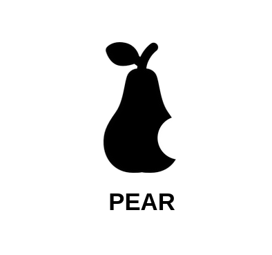

# PROJETO-1-CONSTRUINDO-A-COMUNICA-O-VISUAL-DO-PRODUTO

### Nome da empresa: PEAR
#### Significado do nome: "PEAR" para sua empresa de tecnologia sugere simplicidade e acessibilidade, como a fruta. Destaca-se pela singularidade em um mercado complexo, mas o significado pleno reside na história e valores da marca.

### 1. 🎨 Cores

**Exemplo Visual:**

| Cor | Código Hexadecimal | Justificativa |
| --- | --- | --- |
| Preto | #000000 | Passa sofisticação e elegância |
| Branco | #FFFFFF | Passa leveza e simplicidade |

---

### 2. 🔠 Tipografia

**Exemplo Visual:**

| Fonte | Estilo | Aplicação |
| --- | --- | --- |
| Arimo | Simples, limpa | Títulos |

---

### 3. 🖼️ Elementos Visuais

**Exemplo Visual:**

---
